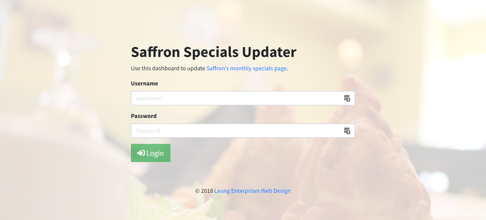
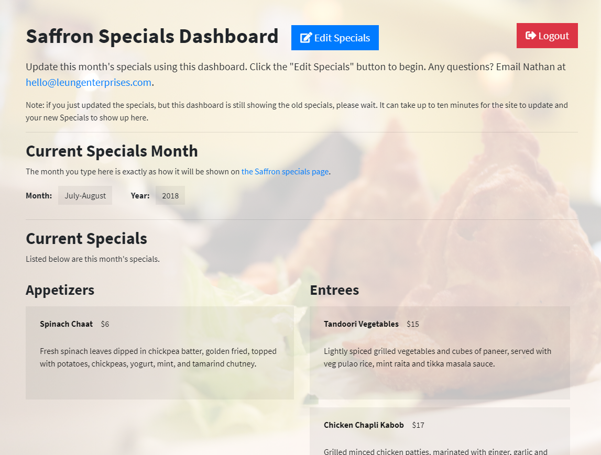
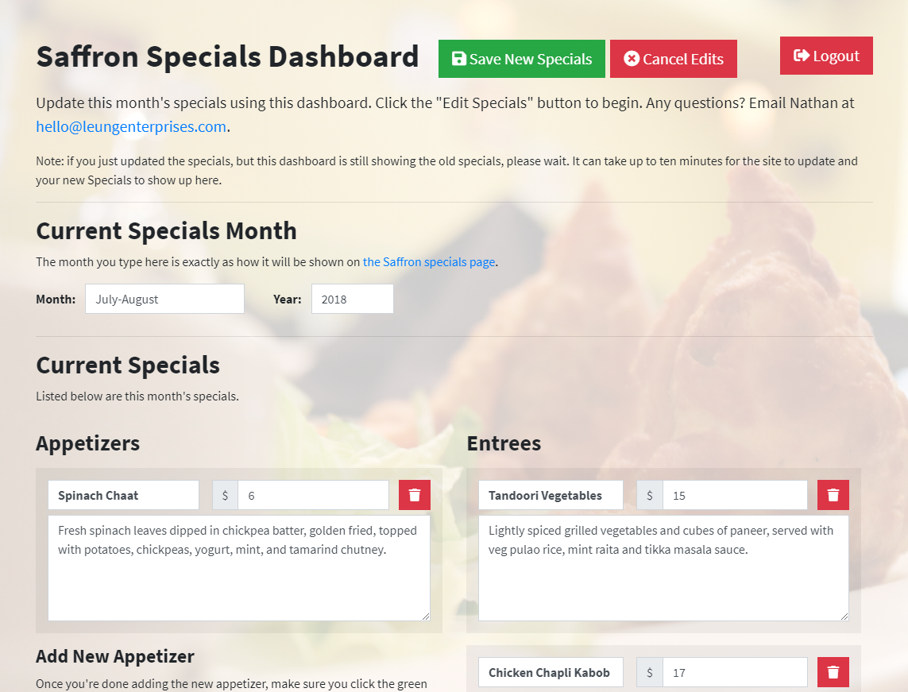
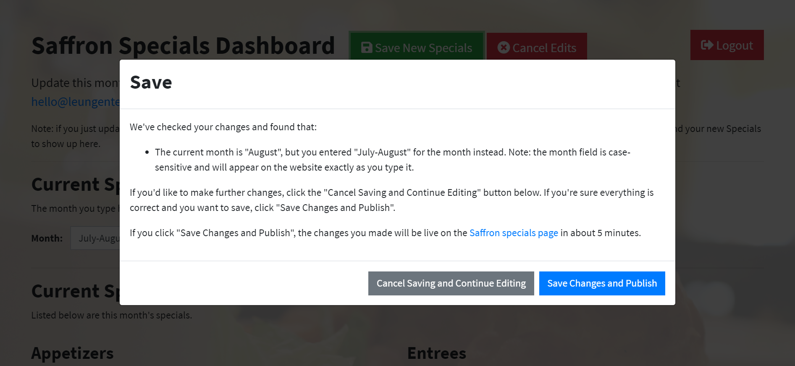

# Saffron Specials Updater
🍗 A serverless function and React control panel to update the monthly specials on Saffron's website. Works on both desktop and mobile.

## Usage
### Login


### View


### Edit


### Save


### View New Specials Page


## Development
### Clone the Repository
* `git clone https://github.com/LeungEnterprisesHosting/saffron-specials-updater`
* `cd saffron-specials-updater`

### Frontend
Starts webpack and watches for file changes, and serves the bundle on http://localhost:3000/.

* `npm run client:dev`

To install new modules, run `npm install` or `yarn add` in the root of the repository.

### Backend
The function is located in the `services/saffron-specials-updater` directory. If you're developing on Windows, see the note about native module in the "Deployment" section.

* `cd services/saffron-specials-updater`
* `serverless invoke local -f ${handler_name} -p fixtures/${mock_data_file}.json`

To install new modules, run `npm install` or `yarn add` in the `services/saffron-specials-updater` directory.

To add new secrets, add the appropriate keys and values to `.env.example` (for documentation purposes) and `.env`. These files will be packaged by `serverless` and deployed alongside the Lambda function.

## API
All endpoints except `/login` are protected &mdash; a valid JWT created by this service is necessary to access them.

### `POST` `/login`
Takes a username and password body (`application/json`) and validates it, returning a JWT that expires in 1 week to use with future requests if successful. In `.env`, set the username with the `USERNAME` key and the password hash with the `PASSWORD_HASH` key (it should be a bcrypt hash with a cost factor of at least 10).

```json
{
  "username": "${username}",
  "password": "${password}"
}
```

### `GET` `/data`
Gets the latest Saffron specials data. May take 5&ndash;10 minutes to update after a change. Requires JWT in Authorization header in the form of `Bearer ${JWT}`.

### `POST` `/data`
Takes the new month, year, and specials (`application/json`) and updates the [Saffron specials page](https://www.saffronofphilly.com/specials) with them. Under the hood, `git clone`s the [website repository](https://github.com/LeungEnterprisesHosting/saffron-indian). Works even when there are no changes to the specials by appending a `rev` key to each file with a UUID v4 value.

```json
{
  "current": {
    "month": "${month}",
    "year": "${year}"
  },
  "specials": {
    "appetizers": [
      {
        "name": "${name}",
        "description": "${description}",
        "price": "${price}",
      },
      ...
    ],
     "entrees": [
      {
        "name": "${name}",
        "description": "${description}",
        "price": "${price}",
      },
      ...
    ]
  }
}
```

## Deployment
### Frontend
The frontend is a React SPA and is hosted on Netlify's static site platform

* `git push origin master` will automatically trigger a rebuild and redeploy of the frontend.

### Backend
The backend is hosted on AWS Lambda. Before you begin, make sure you've set your AWS credentials. To deploy, run the following steps in the `services/saffron-specials-updater` directory.

> Note: if you're developing on Windows and you're using native Node.js modules, you'll need to rebuild them for Amazon Linux, the OS that AWS Lambda functions run on. To rebuild, follow the steps below.
>
> * Make sure you have Docker or Docker Toolbox installed
> * Open the "Docker Quickstart Terminal"
> * `cd` into `services/saffron-specials-updater`
> * Run `./build_native_modules.sh`. Be patient, as this may take a bit of time.
> * The script will copy the rebuilt `node_modules` folder into the `services/saffron-specials-updater` directory.

* `serverless deploy`
